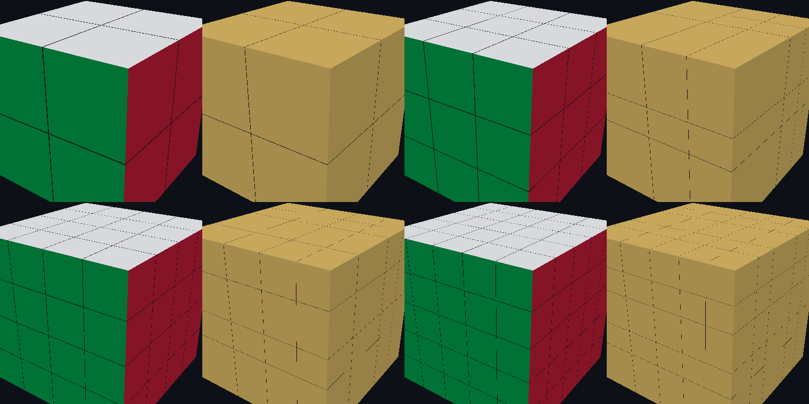

# 电子魔方 · Electronic Rubik's Cube

基于 **Electron + TypeScript** 的三维魔方游戏。渲染器、几何运算、动画、拾取全部手写，**运行时零第三方依赖**（只用 Electron 本体）。



## 特性

- **8 种可玩魔方**：2 / 3 / 4 / 5 阶 × 普通 / 镜面
- **真实的三维操作**：拖拽方块表面转动对应层，拖拽背景旋转视角，滚轮缩放，按住 Shift 做双层转动（宽转）
- **Canvas 2D 手写渲染**：背面剔除 + 画家算法排序，没有任何 WebGL / Three.js
- **通用凸多面体几何**：每个块由若干半空间的交集自动求出，因此立方体、正十二面体、正四面体可以共用同一套切分与转动逻辑
- **内置计时与成绩**：步数统计、最佳成绩、撤销、提示、打乱动画
- **多主题**：标准 / 马卡龙 / 自定义配色
- **157 项模型自测**：转动、撤销、复原、打乱无重叠、贴纸不变量等

## 快速开始

需要 Node.js 18+（建议 20 或更高）。

```bash
npm install
npm start
```

国内网络如果下载 Electron 缓慢，仓库里的 `.npmrc` 已经配好镜像，无需额外设置。

## 操作说明

| 操作 | 效果 |
| --- | --- |
| 拖动方块表面 | 转动对应层（拖动方向决定转法与旋转方向） |
| 拖动背景空白处 | 旋转视角 |
| 滚轮 | 缩放 |
| 按住 `Shift` 拖动 | 宽转（双层 / 多层一起转） |
| `空格` | 打乱 |
| `Z` | 撤销 |
| `R` | 重置 |
| `Esc` | 返回菜单 |
| `F` | 全屏 |

## 常用命令

| 命令 | 作用 |
| --- | --- |
| `npm start` | 构建并启动 |
| `npm run dev` | 构建并启动，同时打开 DevTools |
| `npm run build` | 编译主进程、打包界面、拷贝静态资源 |
| `npm run typecheck` | 类型检查（主进程 + 界面两套配置） |
| `npm run selftest` | 运行模型自测（157 项，不需要 Electron） |
| `npm run smoke` | 真实窗口跑一遍流程并截图到 `preview-out/` |
| `npm run preview` | 离线把 8 种魔方渲染成 `preview-out/sheet.png` |

## 项目结构

```
src/main/     Electron 主进程：窗口、IPC、设置持久化、冒烟测试
src/shared/   与平台无关的纯逻辑：线性代数、凸多面体构造、魔方模型
src/ui/       界面：状态机、视口交互、Canvas 渲染器、相机、菜单、设置
scripts/      Node 工具脚本：自测、离线光栅化出图、资源拷贝
```

运行界面后，`window.__cubeApp` 暴露了应用实例，可以在 DevTools 里直接调 `scramble()`、`undo()`、`updateSettings({ themeId: 'macaron' })` 等。

## 实现要点

- **块的几何**：`src/shared/solid.ts` 用半空间交集构造凸多面体，切割面既可来自立方体的平行面，也可来自正十二面体的十二个面法向，所以换多面体不需要重写几何代码。
- **转动的表示**：一次转动 = 一根过原点的轴 + 一个有符号角度 + 参与转动的块集合。姿态更新带吸附取整，转四圈能精确回到原位，不存在浮点累积。
- **打乱的生成与播放是分离的**：打乱序列必须按「逐条演化」的方式生成（每一步转哪些块取决于前一步的状态），而播放动画时必须回到还原态重放，否则旧的块集合已经不合法，方块会被拧进同一格。
- **镜面魔方的切分必须关于原点对称且三轴共用**，否则块转过 90° 后跨不到正确的格子上。

以上几条都是踩过坑总结出来的硬约束，细节和更多上下文见 [`CODEBUDDY.md`](CODEBUDDY.md)。

## 开发状态

已完成 2~5 阶普通与镜面共 8 种魔方。菜单中另有 5 项占位（二阶五魔方、五魔方、金字塔、枫叶、斜转），几何基础已就绪但玩法尚未实现。

## 许可

本项目尚未选定开源许可证。在明确授权前，请勿直接用于商业用途或二次分发；有需要可以联系作者。
